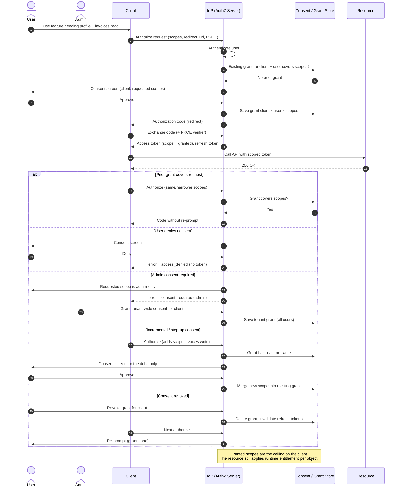

# OAuth Consent — Sequence Diagram

Happy path first: the user is shown the consent screen, approves the requested scopes, a grant is
stored, and a scoped token is issued. Alternates: a prior grant skips the screen, the user denies,
an admin-only scope routes to admin consent, incremental consent for extra scopes, and revocation.

Notes

- **Grant reuse**: an existing grant that covers the requested scopes lets the authorization server
  skip the consent screen — consent is remembered per client × subject × scopes, not asked every time.
- **Admin vs user consent**: admin-only scopes cannot be self-approved; the flow diverts to a
  tenant-wide admin grant that then suppresses per-user prompts for that client.
- **Incremental consent** prompts only for the **delta** and merges it into the stored grant, keeping
  grants least-privilege instead of a single broad up-front approval.
- **Revocation** deletes the grant and invalidates bound refresh tokens, forcing re-consent on the
  next authorization; short access-token lifetimes bound the residual window.
