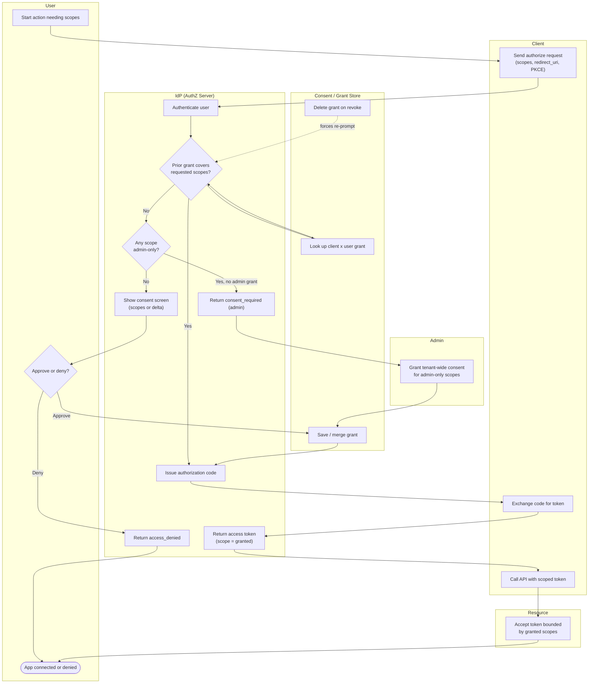

# OAuth Consent — Swimlane Diagram

One lane per actor. The IdP renders consent and records the grant; the consent store decides whether
a screen is needed; the admin lane handles tenant-wide consent.

Notes

- The `I2` gate (**prior grant?**) is what makes consent a one-time experience per scope set: the
  store (`S1`) decides whether the screen (`I4`) is shown at all.
- **Admin consent** short-circuits per-user prompts: once `AD1` saves a tenant grant (`S2`), later
  users hit `I2 → Yes` and never see the screen for that client.
- **Incremental consent** reuses this same path with only the scope **delta** shown in `I4` and merged
  by `S2`.
- **Revocation** (`S3`, dashed) deletes the grant so the next authorization falls back through `I2`
  to a fresh prompt.
