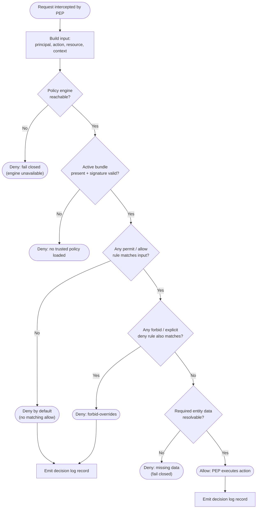

# PBAC Policy Engine (OPA / Cedar) — Decision Flowchart

Evaluation logic from request to decision, including engine availability, bundle integrity,
default-deny, and forbid-overrides. Deny terminals are explicit.

Notes

- Two independent integrity gates precede evaluation: the **engine must be reachable** (else fail
  closed) and the **active bundle must be signature-valid** (else no trusted policy → deny).
- **Default deny** is structural: OPA returns undefined/false when no `allow` is defined; Cedar
  denies when no `permit` matches. Neither implies "allow" on a gap.
- **forbid-overrides** is Cedar's built-in semantics and the conventional Rego pattern — an explicit
  deny always wins, even against a matching allow.
- Both allow and deny outcomes are written to the **decision log**; a denied request is not a silent
  one.
