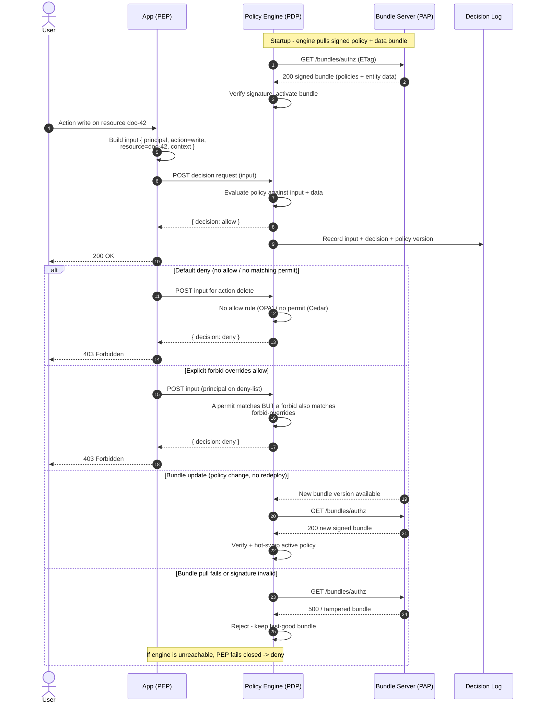

# PBAC Policy Engine (OPA / Cedar) — Sequence Diagram

Happy path first (allow decision from a local engine), then alternates: default-deny, forbid
overriding an allow, an out-of-band bundle update, and a failed/invalid bundle pull. Decision
logging runs alongside.

Notes

- The engine is typically a **sidecar** or embedded library, so the decision call is a localhost
  round trip (sub-millisecond) — not a network hop per request.
- **Decision logs** capture `input`, `decision`, and policy version for every call: the audit trail
  and the primary debugging tool for "why was this denied?".
- Bundles are **pulled** by the engine and **signature-verified** before activation; a bad or
  unreachable bundle leaves the last-good policy in place, and an unreachable engine makes the PEP
  deny.
