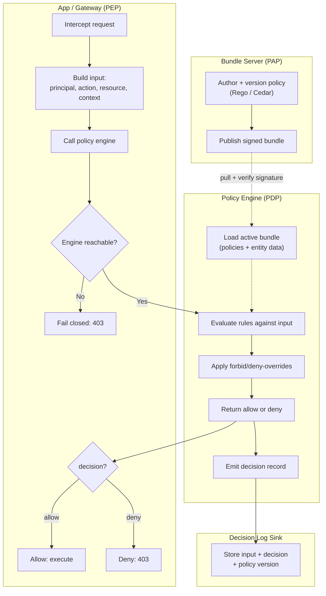

# PBAC Policy Engine (OPA / Cedar) — Swimlane Diagram

One lane per component. The app is the enforcement point; the engine evaluates policy pulled from
the bundle server and emits decision logs.

Notes

- The bundle server lane feeds policy to the engine out of band (dashed): policy changes propagate
  by **bundle pull**, decoupled from the request path and from app deploys.
- `A7` is the fail-closed gate: if the PDP is unreachable, the PEP denies rather than allowing.
- Every decision forks to the **decision log** (`E5 → L1`) for audit and debugging, in parallel with
  returning the result to the PEP.
