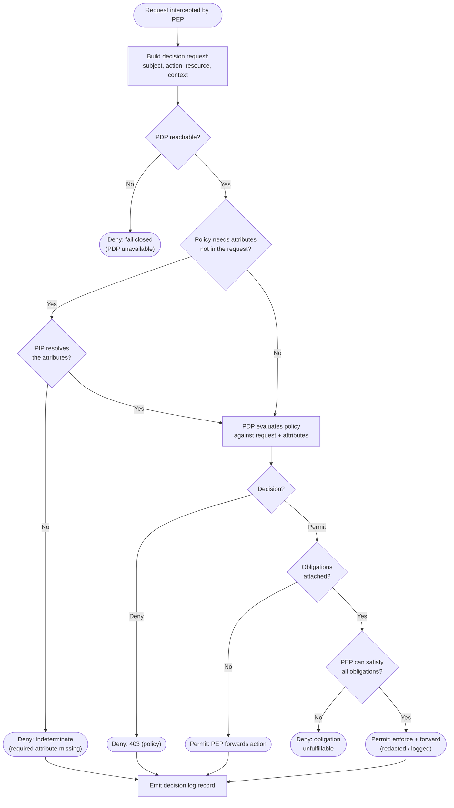

# Policy Decision and Enforcement — Decision Flowchart

Evaluation from intercepted request to enforced outcome, covering PDP availability, attribute
resolution via the PIP, the Permit/Deny/Indeterminate decision, and obligation enforcement. Every
deny and fail-closed path is an explicit terminal.

Notes

- **Three fail-closed terminals** — unreachable PDP, unresolved required attribute
  (`Indeterminate`), and unfulfillable obligation — all deny. There is no default-allow anywhere in
  the chain.
- **Obligations gate the permit**: a Permit with obligations is only released after the PEP applies
  them (`Apply → PermitObl`); if it cannot (e.g. cannot redact), the outcome flips to deny (`DenyObl`).
- The **PIP is on the path only when needed** (`Attr → Fetch`): a self-contained request skips
  attribute resolution, which is the low-latency common case for sidecar PDPs.
- **Both permit and deny are logged**: the decision log is the audit trail and the debugging source
  for "why was this denied?".
