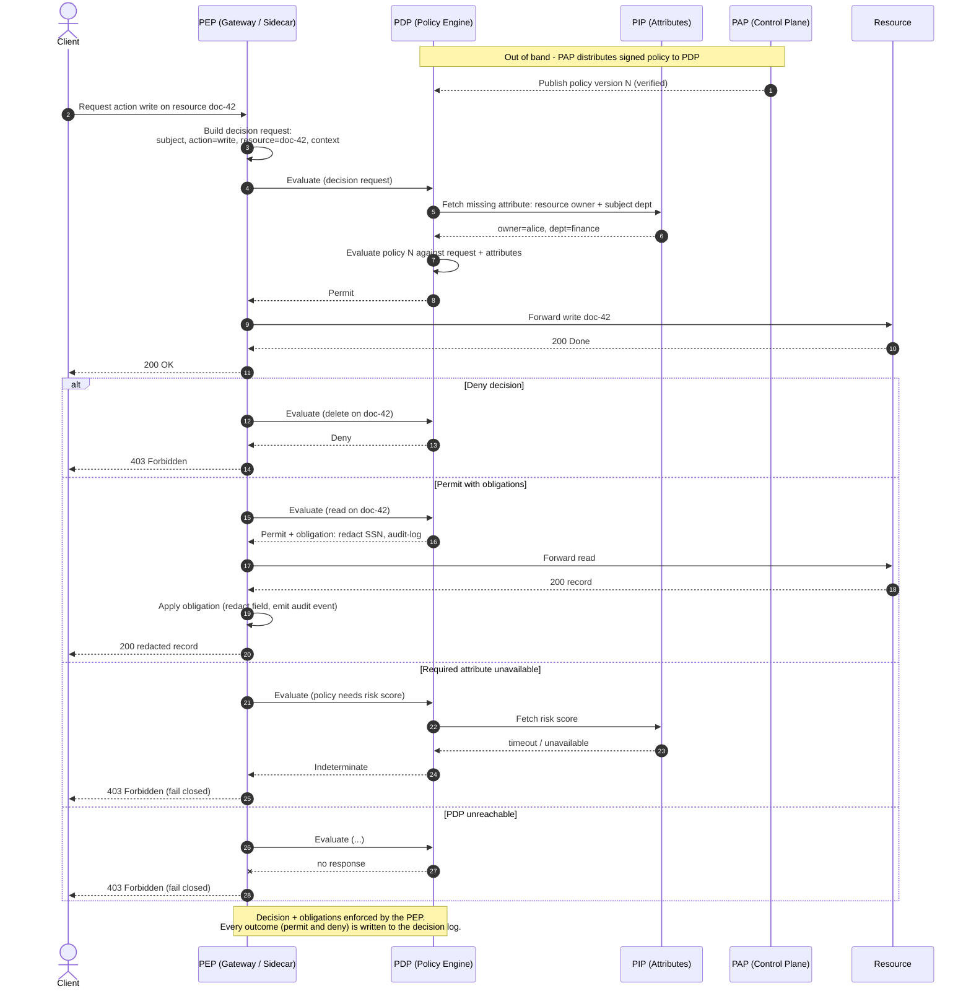

# Policy Decision and Enforcement — Sequence Diagram

Happy path first: the PEP builds a decision request, the PDP fetches a missing attribute from a PIP,
returns Permit, and the PEP enforces it. Alternates: Deny, Permit-with-obligations, PIP unavailable
(Indeterminate → fail closed), and PDP unreachable. Policy arrives from the PAP out of band.

Notes

- **Decision vs enforcement split**: the PDP only returns a verdict (+ obligations); the PEP is the
  only component that touches the request/response and actually blocks, forwards, or transforms.
- **Obligations are mandatory**: on Permit-with-obligation the PEP must complete the obligation
  (redact, log, set header) before releasing the response; if it cannot, the effective result is deny.
- **Fail-closed defaults**: `Indeterminate` (unresolvable attribute) and an unreachable PDP both
  become a deny at the PEP — the request is never allowed on a gap.
- **PAP is off the request path**: policy is distributed to the PDP asynchronously, so policy changes
  do not require redeploying the PEP or services.
