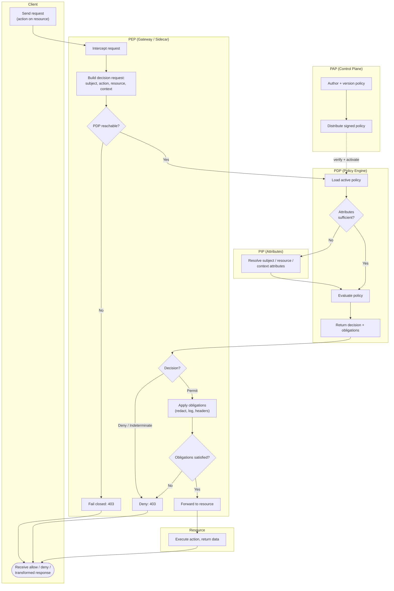

# Policy Decision and Enforcement — Swimlane Diagram

One lane per component. The PEP enforces; the PDP decides; the PIP supplies missing attributes; the
PAP distributes policy out of band. Obligations are applied back in the PEP lane.

Notes

- The **PAP lane feeds the PDP out of band** (dashed): policy propagates by distribution, decoupled
  from the request path and from PEP/service deploys.
- `P3` and `P5`'s `Indeterminate` branch are the **fail-closed** gates — an unreachable PDP or an
  undecidable request both deny.
- **Obligations round-trip through the PEP** (`P6 → P7`): a permit is only honored if its obligations
  are fully applied; otherwise it falls through to deny (`P9`).
- The PIP is consulted **only when the decision request lacks an attribute** the policy needs
  (`D2 → N1`), keeping the common path a single decision call.
