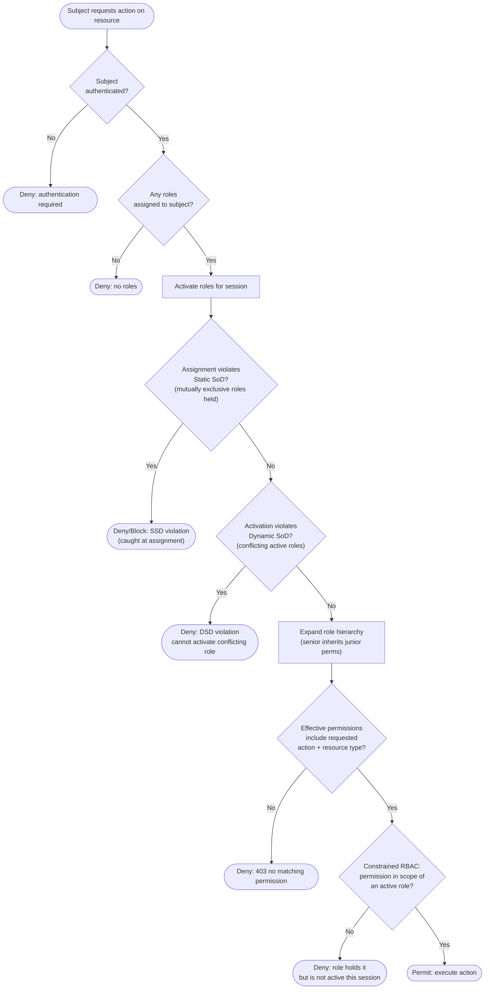

# RBAC — Decision Flowchart

The full permit/deny logic: session activation with Separation of Duty gates, hierarchy expansion,
and the permission match. Deny terminals are explicit.

Notes

- RBAC matches on **resource type**, not resource instance: it can grant `invoice:approve` but not
  "approve *this* invoice because you own it". Instance-level conditions belong to
  [ABAC](../abac/README.md) or [ReBAC](../rebac-zanzibar/README.md).
- The two SoD gates run at different times: SSD at **assignment** (a user can never be granted both
  roles), DSD at **session activation** (both may be held but not simultaneously active).
- If you find yourself adding a decision here for region, tenant, tier, or ownership, that is the
  **role-explosion** signal — encode it as an attribute or relationship, not a new role.
