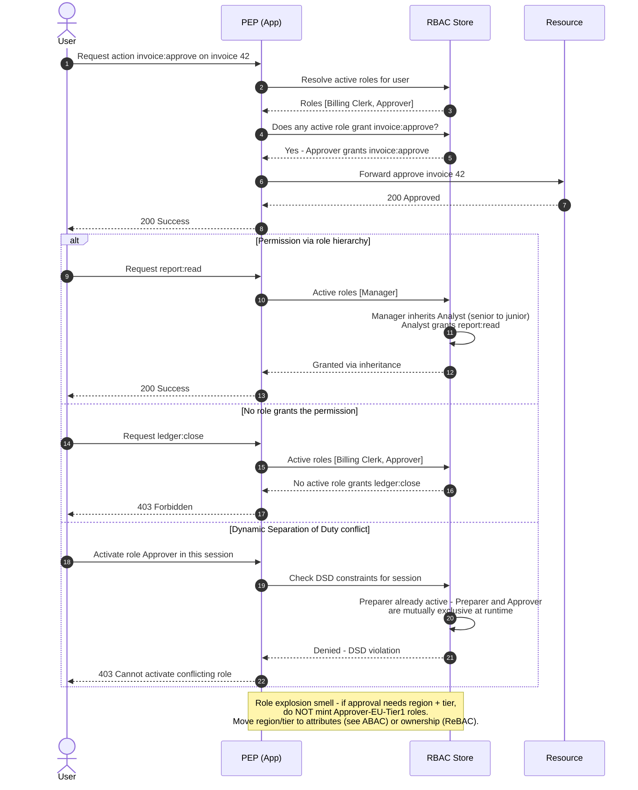

# RBAC — Sequence Diagram

Happy path first (a role grants the permission), then alternates: permission inherited through
the role hierarchy, denial when no active role grants it, a Dynamic Separation of Duty conflict at
role activation, and the role-explosion note.

Notes

- Role resolution reads only **active** roles for the session (constrained RBAC); a user may hold
  more roles than are activated.
- Hierarchy inheritance is transitive: a senior role gets the permissions of every role beneath it.
- Static SoD is enforced earlier, at **assignment** time (a user may never be granted both roles);
  DSD is enforced here, at **activation** time.
