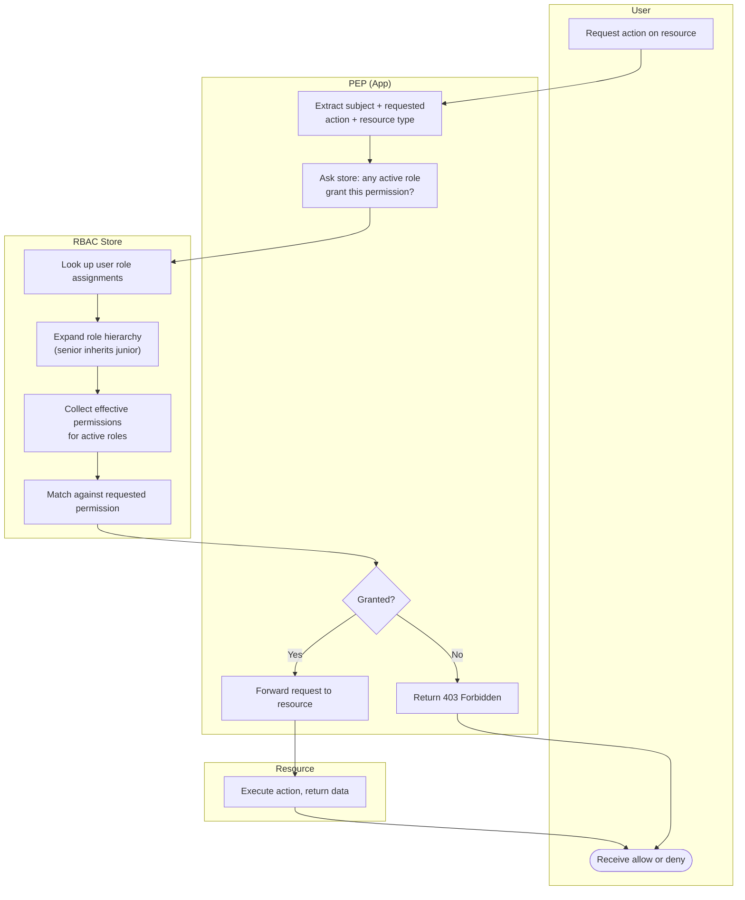

# RBAC — Swimlane Diagram

One lane per actor. The RBAC store lane resolves roles and permissions; the PEP enforces the result.

Notes

- `S2` is the hierarchy expansion: a `Manager` role that is senior to `Analyst` picks up every
  `Analyst` permission before matching.
- Only **active** roles feed `S3` — constrained-RBAC session activation is upstream of this check
  and is where Dynamic Separation of Duty is enforced (see [flowchart.md](./flowchart.md)).
- The store is typically a cached, in-memory projection; a slow round trip per request is the main
  performance pitfall at scale.
