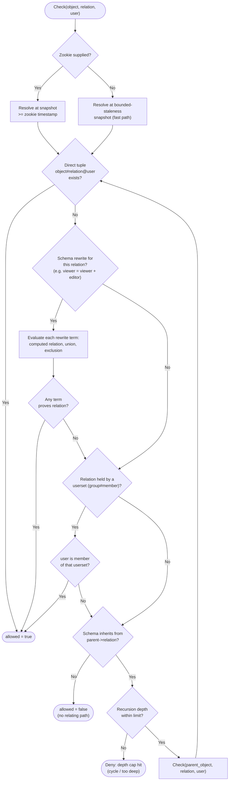

# ReBAC / Zanzibar — Decision Flowchart

How a single Check(object, relation, user) is evaluated: direct tuple, userset rewrites, group
membership, and parent inheritance, with recursion bounds. Deny terminals are explicit.

Notes

- Evaluation **short-circuits** on the first path that proves the relation; only an exhausted search
  yields `allowed = false`. There is no ambient "deny" — deny is the absence of any relating path.
- **Exclusion** rewrites (`viewer = viewer - banned`, where supported) can turn a would-be allow
  into a deny; evaluate them within the union term, not as a separate ambient rule.
- The **depth cap** and cycle detection bound Check cost — pathological parent chains or mutually
  recursive groups must terminate, both for latency and to prevent denial-of-service.
- The zookie choice at the top trades latency for freshness; after a revoke, always take the
  `>= zookie` path so the deny is guaranteed visible.
