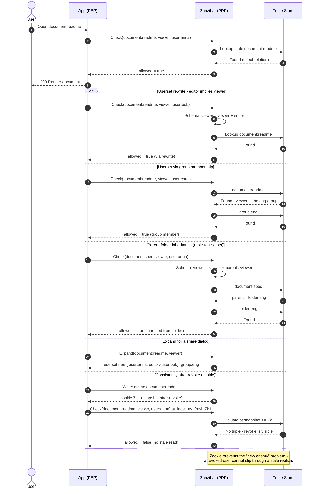

# ReBAC / Zanzibar — Sequence Diagram

Happy path first (direct tuple Check), then alternates: userset rewrite (editor implies viewer),
group membership, parent-folder inheritance, Expand, and a consistency-token (zookie) read after a
revoke.

Notes

- **Check** returns a boolean; **Expand** returns the whole userset tree (for share UIs and audit).
- Rewrites (`viewer = viewer + editor`), group usersets, and `parent->viewer` all compose in the
  schema — the evaluation walks the tuple graph until it finds the user or exhausts the paths.
- Passing the **zookie** from a write into a later Check requests an at-least-as-fresh snapshot,
  trading a little latency for correctness after security-relevant changes.
