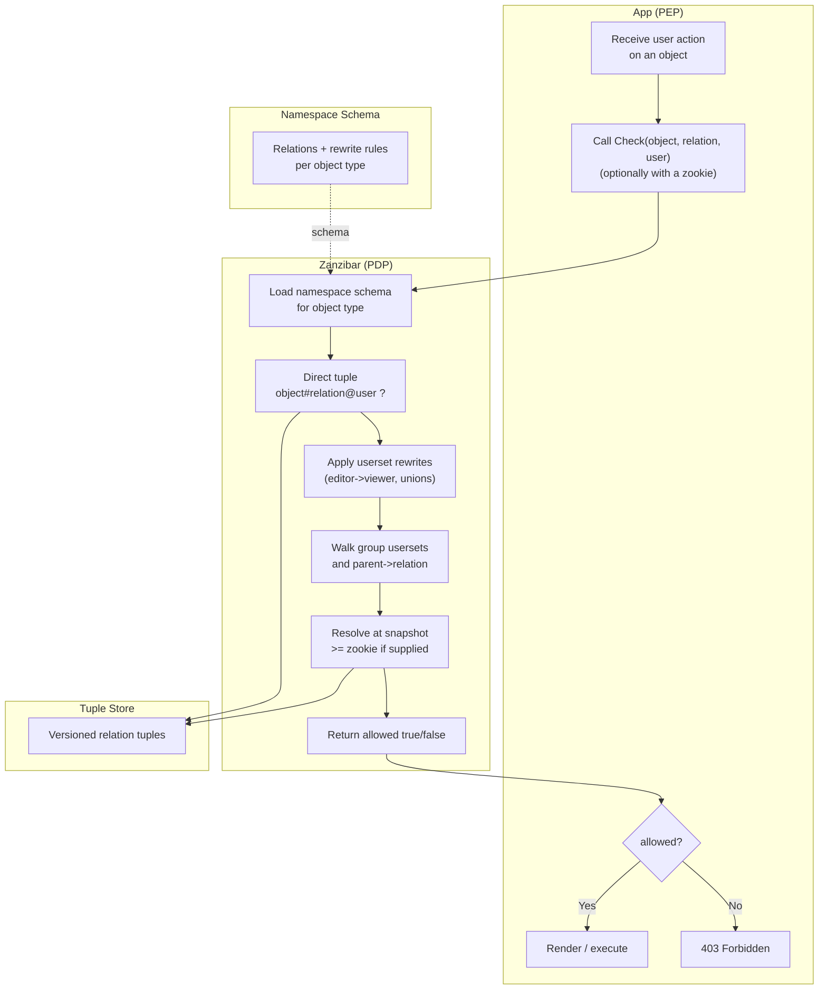

# ReBAC / Zanzibar — Swimlane Diagram

One lane per component. The app calls Check; the Zanzibar service walks tuples and schema rewrites
to answer.

Notes

- The schema lane feeds rewrite rules into evaluation (dashed) — it defines how `viewer`, `editor`,
  group membership, and `parent` relations compose.
- `Z2 → Z3 → Z4` is the graph walk: try the direct tuple, then computed usersets, then group and
  parent inheritance, short-circuiting as soon as a path proves the relation.
- `Z5` enforces consistency: with a **zookie** the store answers from a snapshot no older than the
  referenced write, closing the stale-read window after a revoke.
