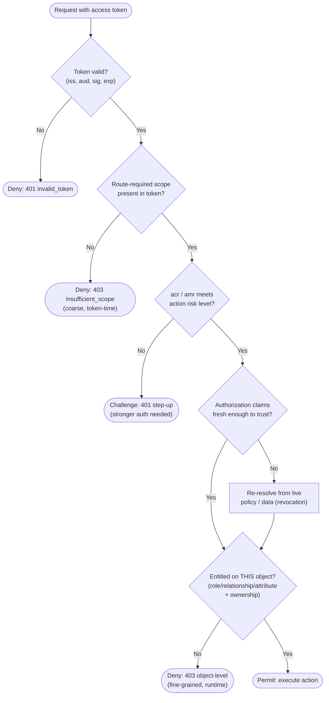

# Scopes, Claims, Entitlements — Decision Flowchart

The layered decision: validate the token, check the coarse **scope** at the gateway, then resolve
the fine-grained **entitlement** at the resource against live data. Each layer has an explicit deny
terminal; passing a coarse layer never implies the fine one.

Notes

- **Two distinct deny terminals** matter operationally: `insufficient_scope` means the *client* was
  never granted the capability (fix by re-consenting a broader/incremental scope), while the
  object-level `403` means the *subject* lacks permission on *this* resource (a data/policy fact, not
  a token problem).
- **Scope check is necessary, not sufficient.** The `Scope` diamond is a ceiling on delegated client
  authority; the `Ent` diamond is the real access decision. Skipping `Ent` and trusting scope is the
  broken-object-level-authorization (BOLA/IDOR) vulnerability.
- **Claim freshness gate** (`Fresh`): when a role/entitlement claim may be stale, the resource
  re-resolves against live data so a revocation takes effect before the token expires.
- `acr`/`amr` gate handles **step-up**: a low-assurance token is fine for reads but challenged for
  high-risk actions.
