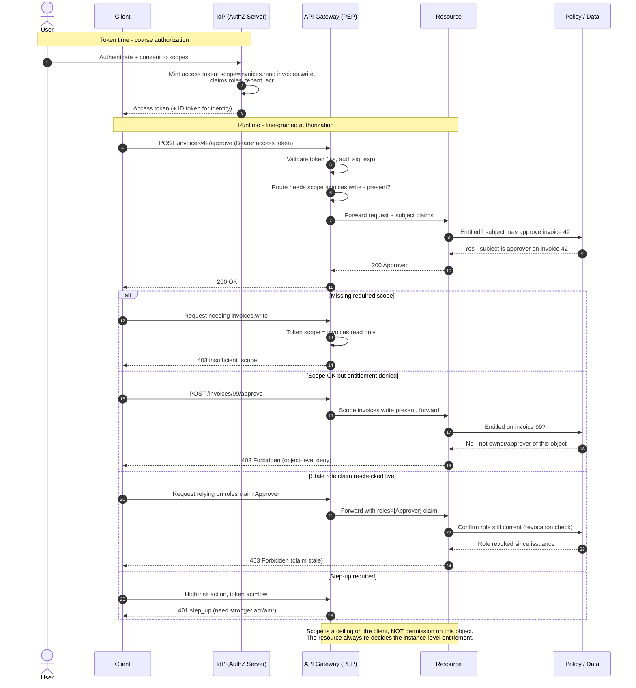

# Scopes, Claims, Entitlements — Sequence Diagram

Happy path first: the client obtains a token stamped with scopes and claims (coarse, token-time),
then a request passes the gateway scope check and the resource's fine-grained entitlement check.
Alternates: missing scope, scope present but entitlement denied, a stale role claim re-checked
against live data, and a step-up requirement.

Notes

- **Token time vs runtime**: scopes and claims are fixed when the token is minted; the entitlement
  is resolved per request against live policy/data, so it reflects the current state, not issuance.
- **Two gates, two failure modes**: the gateway returns `insufficient_scope` (coarse) while the
  resource returns an object-level `403` (fine-grained). Passing the first never implies the second.
- **Claim freshness**: role/group/entitlement claims are point-in-time; sensitive actions re-verify
  against authoritative data rather than trusting the token's snapshot.
