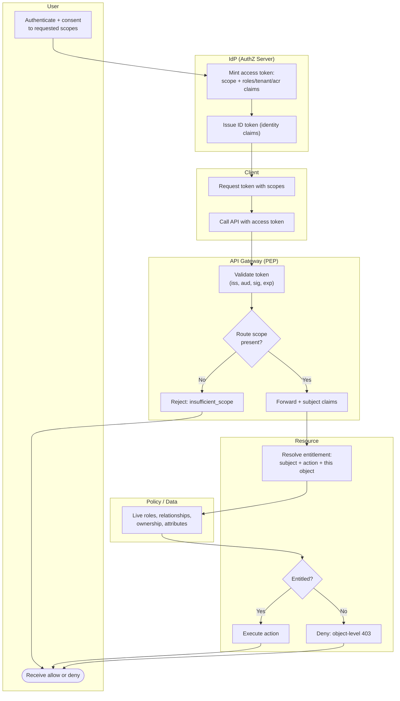

# Scopes, Claims, Entitlements — Swimlane Diagram

One lane per actor. The IdP stamps scopes and claims at token time; the gateway does the coarse
scope check; the resource resolves the fine-grained entitlement against live policy/data.

Notes

- **Coarse vs fine boundary** is the `GW → API` handoff: the gateway only knows scopes and token
  claims, the resource re-decides against live data (`D1`) for the specific object.
- The IdP lane runs **once at token time**; the gateway and resource lanes run **per request** for
  the token's whole lifetime, which is why revocation must be re-checked at the resource.
- ID-token claims (`I2`) are for **identity**, not for the access decision — the entitlement uses the
  access token's authorization context plus live data.
