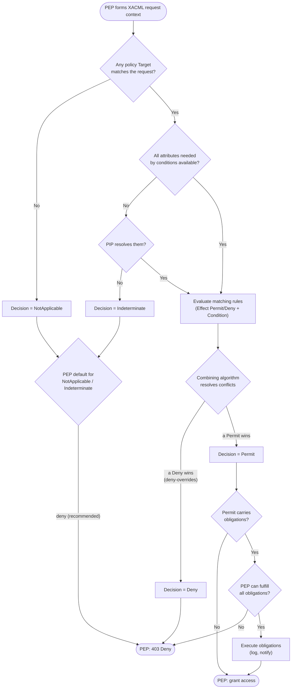

# XACML — Decision Flowchart

Policy evaluation from Target matching through the combining algorithm to the four XACML decisions,
then the PEP's obligation and default handling. Deny terminals are explicit.

Notes

- **Four decisions, not two**: Permit, Deny, NotApplicable, Indeterminate. Only the PEP turns them
  into allow/deny, and the safe default for the latter two is **deny**.
- The **combining algorithm** (deny-overrides, permit-overrides, first-applicable, and their
  `*-unless-*` variants) is where multiple matching rules/policies are reconciled — choose it
  deliberately.
- The **obligation gate** makes Permit conditional: an unfulfillable obligation converts a Permit
  into a deny. Advice, by contrast, never blocks the grant.
