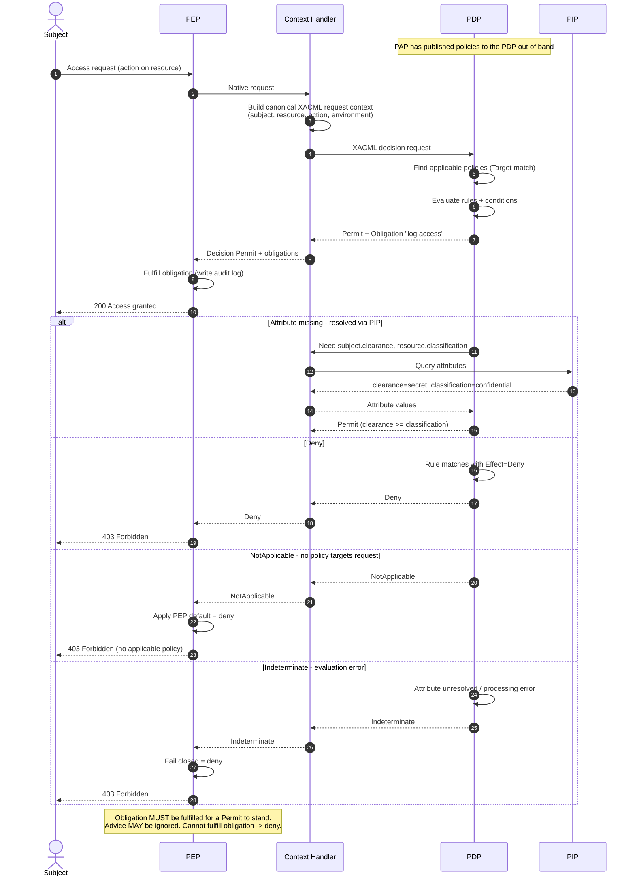

# XACML — Sequence Diagram

Happy path first (Permit with a fulfilled obligation), then alternates: an attribute resolved via a
PIP, a Deny, NotApplicable, and Indeterminate. The Context Handler mediates between PEP and PDP.

Notes

- The **Context Handler** is the integration seam: it canonicalizes the request and drives PIP
  attribute retrieval so the PDP only sees a complete XACML request context.
- A Permit is **conditional on its obligations**: if the PEP cannot fulfill a returned obligation,
  it must not grant access.
- **NotApplicable** (no policy targets the request) and **Indeterminate** (evaluation error) are
  distinct from Deny; the PEP maps both to a fail-closed deny.
