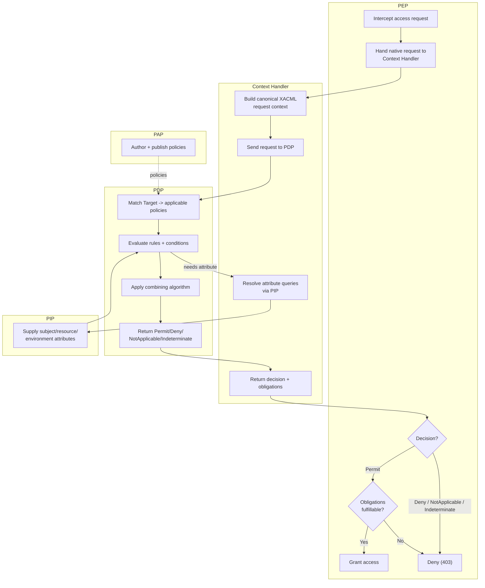

# XACML — Swimlane Diagram

One lane per XACML component. The Context Handler sits between the PEP and PDP; the PAP feeds
policy and the PIP feeds attributes.

Notes

- The PAP lane publishes policy to the PDP out of band (dashed); the PIP lane answers attribute
  queries mediated by the Context Handler during evaluation.
- The **obligation gate** (`E4`) is unique to the PEP lane: a Permit only becomes a grant if its
  obligations can be fulfilled — otherwise it collapses to deny.
- NotApplicable and Indeterminate both route to the deny terminal via the PEP's fail-closed default.
