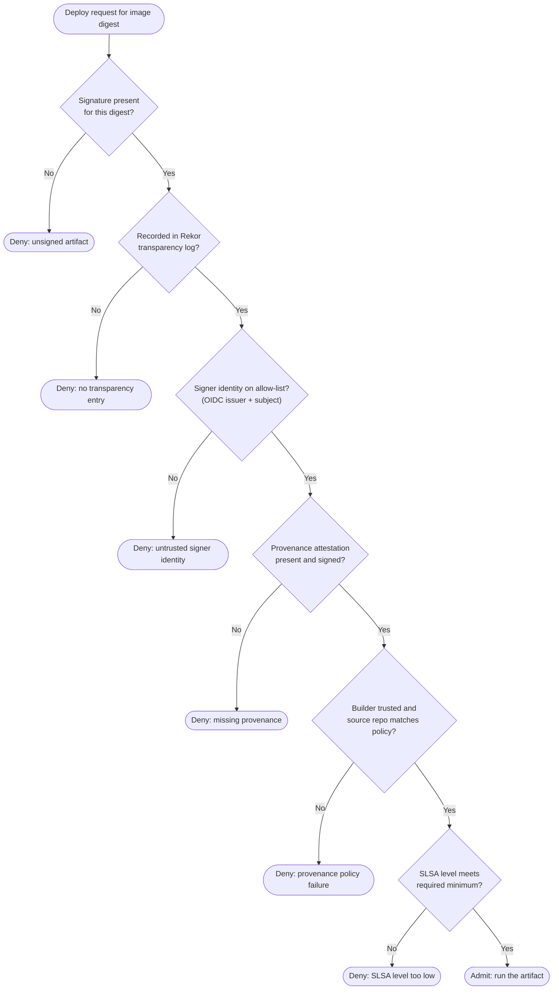

# Artifact Signing and Provenance — Decision Flowchart

The admission-time verification gates, in order. Every failure terminates in an explicit deny
node. Build-time choices (keyless vs key-based) feed the same admission checks.

Notes

- Order matters: presence of a signature (`Q1`) is checked before who signed it (`Q3`), and
  identity is checked before provenance policy (`Q5`) — a valid signature from the wrong
  identity is denied regardless of provenance.
- `Q3` is the check most often skipped in practice: verifying **who** signed, not just that
  **a** signature verifies. Keyless signing makes the identity a first-class, logged claim.
- The same gates apply to key-based signing; only the identity check differs (matching a
  pinned public key instead of an OIDC identity). Keyless is preferred to avoid key storage.
