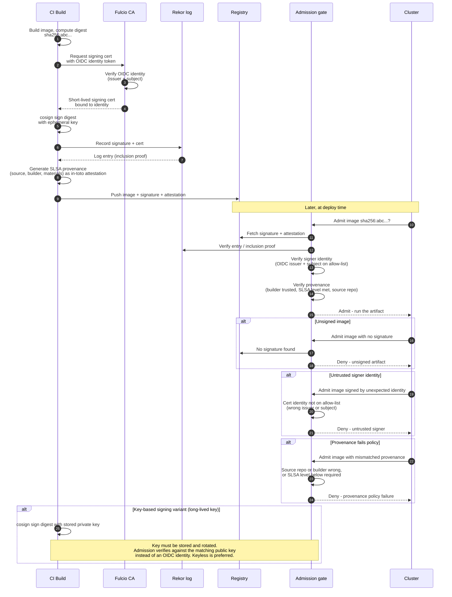

# Artifact Signing and Provenance — Sequence Diagram

Happy path first (keyless build-time sign + attest, then verify at admission), followed by the
rejection alternates: unsigned image, untrusted signer identity, provenance fails policy, and
the key-based signing variant.

Notes

- Keyless signing binds the signature to the CI job's OIDC identity via Fulcio; the
  certificate is short-lived, so there is no signing key at rest.
- Rekor gives tamper-evidence: the admission gate can confirm the signature was logged.
- Admission enforces **identity + provenance**, not merely "a signature exists" — the three
  deny branches are all valid-looking artifacts that fail an identity or policy check.
