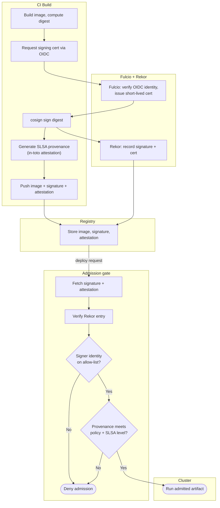

# Artifact Signing and Provenance — Swimlane Diagram

One lane per component. Build-time signing/attesting is on the left; verify-on-deploy handoffs
cross into the Admission lane, which gates the Cluster.

Notes

- The build lanes produce three things — image, signature, provenance — and the transparency
  log entry ties the signature to a logged identity.
- Both admission gates (`A3` identity, `A4` provenance) must pass; unsigned artifacts fail at
  `A1`/`A2` before reaching them.
- See [flowchart.md](flowchart.md) for the full admission decision tree and every deny reason.
