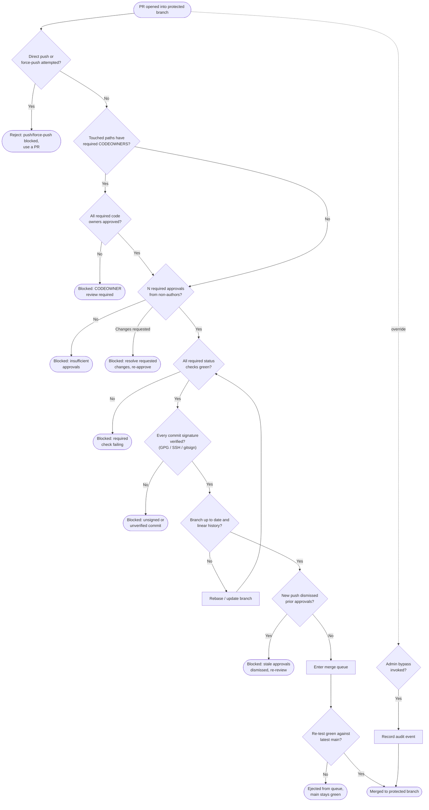

# Branch Protection and Code Review — Decision Flowchart

Every gate between "PR opened" and "merged to a protected branch": required reviews,
CODEOWNERS approval for touched paths, required status checks, signed commits, up-to-date /
linear history, and the merge-queue re-test. Each unmet gate has an explicit block terminal.

Notes

- The first gate rejects direct pushes and force-pushes outright: everything reaches a protected
  branch through a PR.
- CODEOWNERS approval is evaluated per touched path; a sensitive path (`.github/workflows/`,
  deploy config) with no owner approval blocks the merge even when the numeric review count is met.
- The `Fresh` loop sends an updated branch back through required checks, since re-basing can
  change what CI sees.
- The merge queue's `Retest` gate is the last line: a PR green in isolation is re-tested against
  the current tip and ejected on a semantic conflict rather than breaking `main`.
- Admin bypass is drawn as a dotted, audited side path — the discouraged escape hatch, not a
  normal route to merge.
