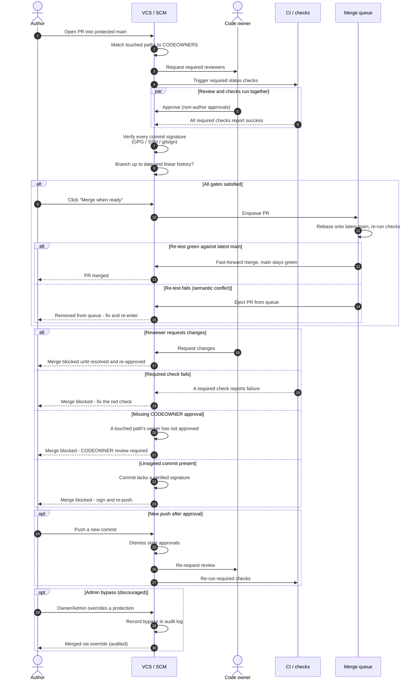

# Branch Protection and Code Review — Sequence Diagram

Happy path first (PR opens, CODEOWNERS reviewers requested, approvals granted, required checks
pass, signed commits verified, enters the merge queue, re-tested against latest `main`, merged),
then alternates: requested changes, a failing check, a missing CODEOWNER approval, an unsigned
commit, a stale-approval dismissal on new push, a merge-queue re-test failure, and an audited
admin bypass.

Notes

- Review and required checks run in parallel; both must be satisfied before the PR is eligible
  for the merge queue.
- The merge queue's value is the re-test in the `MQ` block: a PR that was green in isolation is
  re-tested against the current tip of `main`, so a semantic conflict ejects it instead of
  breaking the branch.
- Dismissing stale approvals on a new push forces fresh review, closing the "approve then push
  unreviewed code" gap.
- Admin bypass always emits an audit event; it is the escape hatch, not the norm.
