# Branch Protection and Code Review — Swimlane Diagram

One lane per actor / component. Cross-lane arrows are the handoffs from opening a PR through
merge-queue re-test to a merged, still-green `main`. Block branches leave their gate lane.

```mermaid
flowchart TD
    subgraph Author["Author"]
        A1["Open PR into protected main"]
        A2["Push fix / re-sign commits"]
        A3(["See PR merged"])
    end

    subgraph SCM["VCS / SCM"]
        S1["Match touched paths to CODEOWNERS"]
        S2["Request required reviewers"]
        S3["Collect approvals and check results"]
        S4{"All gates green?<br/>(reviews, checks,<br/>signatures, up-to-date)"}
        S5["Enqueue in merge queue"]
        S6(["Merge to main"])
        SB(["Merge blocked<br/>(unmet gate)"])
    end

    subgraph Review["Reviewer / code owner"]
        R1["Review changes"]
        R2["Approve (non-author)"]
        R3["Request changes"]
    end

    subgraph CI["CI / checks"]
        C1["Run required status checks"]
        C2["Report success / failure"]
    end

    subgraph MQ["Merge queue"]
        M1["Rebase onto latest main"]
        M2["Re-run checks against latest main"]
        M3{"Re-test green?"}
        M4(["Eject PR - not merged"])
    end

    A1 --> S1 --> S2 --> R1
    S2 --> C1 --> C2 --> S3
    R1 --> R2 --> S3
    R1 --> R3 --> SB
    S3 --> S4
    S4 -->|No| SB
    SB -.->|"fix"| A2 --> S3
    S4 -->|Yes| S5 --> M1 --> M2 --> M3
    M3 -->|No| M4 -.->|"re-enter"| A2
    M3 -->|Yes| S6 --> A3
```

Notes

- The `S4` gate is the aggregate merge check: required approvals (non-author), all required
  status checks green, every commit signature verified, and the branch up to date with a linear
  history.
- A **requested-changes** review (`R3`) and any unmet gate route to the same blocked terminal;
  the author fixes and re-enters at `S3`.
- The merge queue lane re-tests against the latest base (`M2`); ejection at `M4` is what keeps
  a semantic conflict from ever reaching `main`.
- See [flowchart.md](flowchart.md) for each individual gate and its explicit fail terminal.
