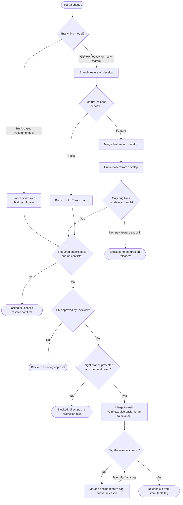

# Branch-Based Code Promotion — Decision Flowchart

Choosing a model, then the gates each promotion must clear. Blocked promotions
terminate explicitly; a release only exists once a protected commit is tagged.

Notes

- Model choice only changes the branch topology on the left; both funnel into the same
  checks → review → protected-merge → tag gates.
- The `Flagged` node captures trunk-based's key property: code can merge to `main`
  behind a feature flag without being released, so deploy and release stay decoupled.
- Every terminal that is not `Rel` is a blocked promotion; nothing reaches a release
  without a protected merge and a tag.
