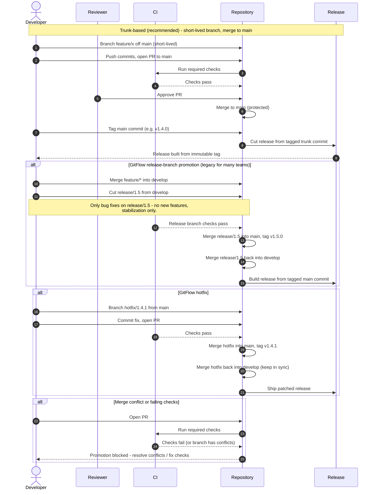

# Branch-Based Code Promotion — Sequence Diagram

Happy path first: the trunk-based flow (short branch, PR, review, CI, merge to `main`,
tag a release). Then the GitFlow alternates — release-branch promotion and a hotfix —
and a blocked-promotion case when checks fail.

Notes

- Trunk-based keeps branches short so integration is continuous and merges stay small;
  the release is just a tag on `main`, and feature flags hide unfinished work behind it.
- GitFlow's `develop → release/* → main` chain adds long-lived branches whose divergence
  is the source of its heavyweight, slow-integration reputation.
- Both models promote through the same protected-branch and required-check gates; only
  the branch topology differs.
