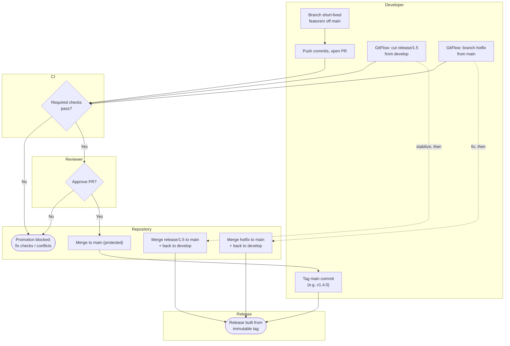

# Branch-Based Code Promotion — Swimlane Diagram

One lane per actor. The main path is the trunk-based flow; the GitFlow release and
hotfix branches join the Repository lane as alternate promotion routes.

Notes

- Trunk-based is the solid path: `feature/x → PR → main → tag → release`, gated by CI
  and review.
- The dotted GitFlow routes fan more branches through the Repository lane
  (`release/1.5` and `hotfix`), both merging back to keep `develop` in sync — the
  bookkeeping that makes GitFlow heavier.
- Every route reaches `Release` only through a protected merge and a tag; failing
  checks or conflicts divert to the blocked terminal.
