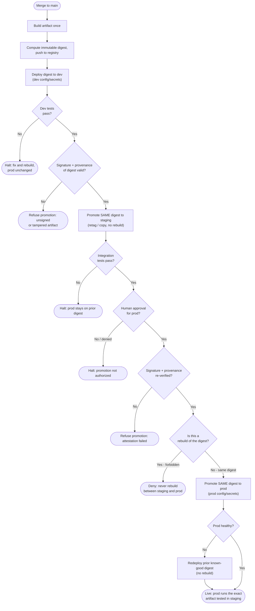

# Environment-Based Promotion — Decision Flowchart

The promotion logic: build once, then at every hop check the gate and re-verify provenance
before advancing the **same digest**. Halt, rollback, and refusal terminals are explicit.

Notes

- Provenance is re-checked before *each* promotion (`ProvS`, `ProvP`), not only at build time.
- The `RebuildCheck` gate encodes the core rule: a promotion must carry the existing digest, so
  any rebuild between environments is denied outright.
- Rollback is a redeploy of a digest already in the registry — it never routes back through `Build`.
