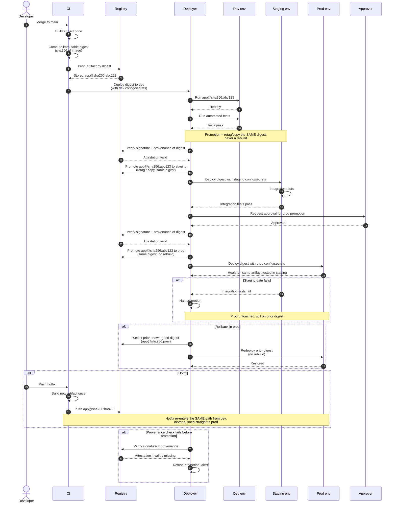

# Environment-Based Promotion — Sequence Diagram

Happy path first: build the artifact once, then promote the **same digest** through dev,
staging, and prod behind gates. Then alternates: a staging gate failure that halts before
prod, a rollback to a prior good digest, a hotfix rebuild re-entering from dev, and a
provenance check that refuses a bad digest.

Notes

- The digest `app@sha256:abc123` is computed once at build and is the only thing promoted;
  every environment runs that byte-for-byte identical artifact.
- Config and secrets are injected per environment at deploy time — the binary never changes.
- "Promote" is always a retag or cross-registry copy of the existing digest, never `docker build`.
- Rollback selects a prior digest already in the registry; it is a redeploy, not a rebuild.
