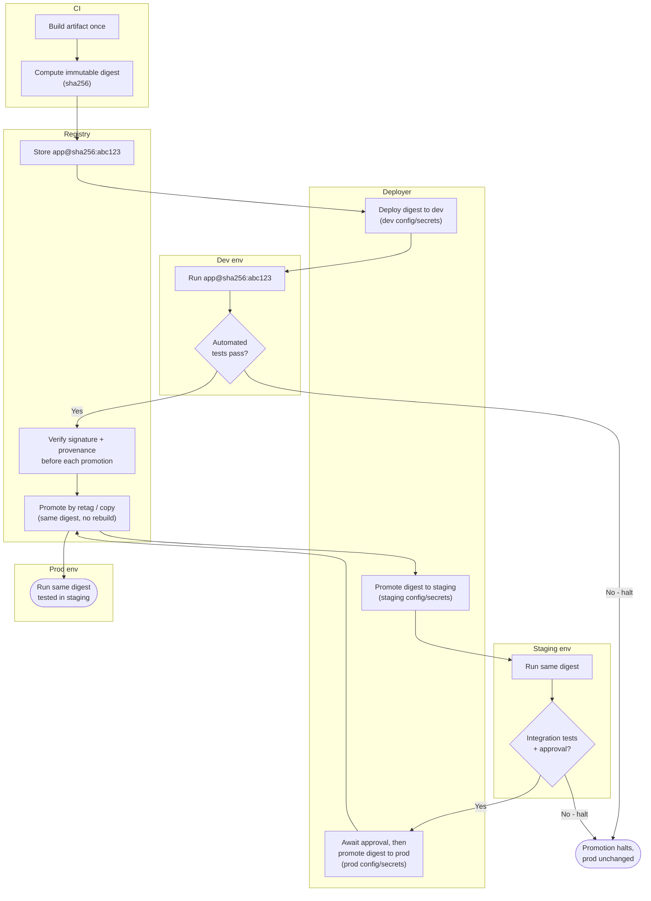

# Environment-Based Promotion — Swimlane Diagram

One lane per component. The single digest built by CI flows left to right; each cross-lane
arrow into an environment is a promotion of the **same digest**, gated before it advances.

Notes

- The one artifact (`app@sha256:abc123`) built in the CI lane is the only thing that moves;
  `R3` reuses it for every environment via retag/copy.
- Environment lanes differ only in injected config/secrets — never in the binary.
- Both gates (`D2`, `S2`) route failure to the same `Halt` terminal, leaving prod on its prior digest.
- Rollback (not drawn) is the Deployer redeploying a prior digest already stored in the Registry lane.
