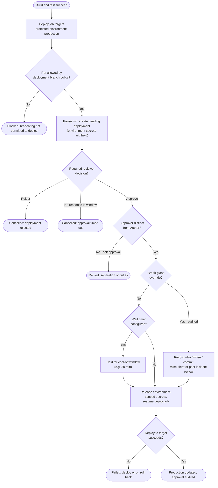

# Environment Protection and Approvals — Decision Flowchart

Every gate the protected environment applies between a successful build and a live
deploy. Deny and cancel paths terminate explicitly; secrets are released only at the
single node past all gates.

Notes

- The branch policy gate runs *before* the approval request, so a disallowed ref
  never even pauses for a reviewer.
- `Release` is the only node that exposes environment-scoped secrets; every deny or
  cancel terminal sits upstream of it.
- The break-glass branch still passes through `Release` but writes an audit record and
  raises an alert, unlike the normal approved path.
