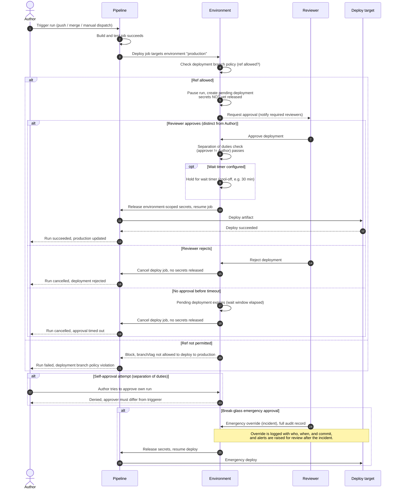

# Environment Protection and Approvals — Sequence Diagram

Happy path first: build succeeds, the deploy job targets a protected environment,
the run pauses for a required reviewer, the wait timer elapses, scoped secrets are
released, and the deploy proceeds. Then the alternates: rejection, timeout,
disallowed branch, self-approval blocked, and a break-glass override.

Notes

- The pending deployment holds the run *before* any environment secret is exposed,
  so a rejected or timed-out approval never leaks credentials.
- GitHub Actions models this with required reviewers plus a wait timer; GitLab with
  deployment approvals on a protected environment; Jenkins with an `input` step
  guarding the deploy stage.
- The separation-of-duties check rejects the Author approving their own run even if
  they are otherwise a valid reviewer.
