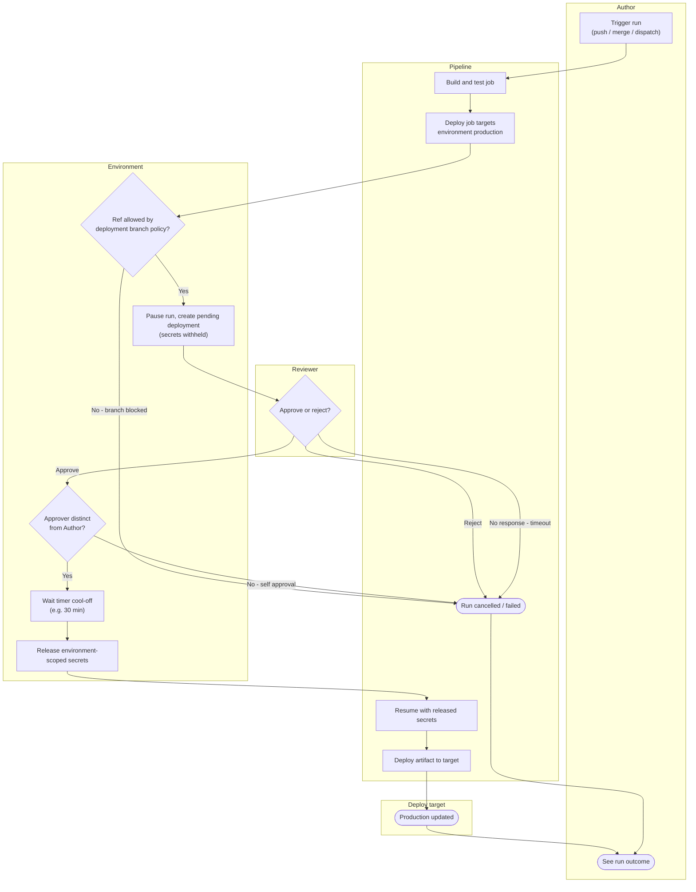

# Environment Protection and Approvals — Swimlane Diagram

One lane per actor. Arrows crossing lanes show the handoffs from build, through the
protection gate and human approval, to the actual deploy.

Notes

- The `E2 --> R1` handoff is the pause: the run holds in the Environment lane with
  secrets withheld until the Reviewer acts.
- Every path that does not reach `E5` leaves the environment-scoped secrets
  unreleased, so a blocked, rejected, timed-out, or self-approved run never gets them.
- The break-glass override (see [flowchart.md](flowchart.md)) is an audited path that
  re-enters at `E5` for incidents.
