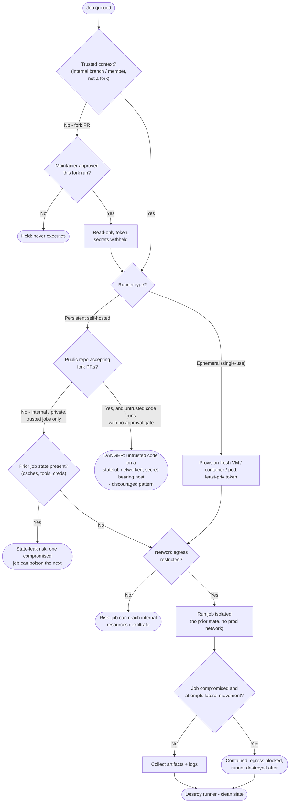

# Ephemeral Runner Isolation — Decision Flowchart

Every gate between "a job is queued" and "it executes somewhere": is the context trusted, does a
fork PR have approval, is the runner ephemeral or persistent, and is network egress restricted.
The discouraged combination terminates at an explicit danger node.

Notes

- The fork-PR branch gates on maintainer approval and strips secrets before any runner is even
  chosen; an unapproved fork PR simply never executes.
- The `Public` decision is the risky combination the topic calls out: a persistent self-hosted
  runner on a public, fork-accepting repo with no approval gate lands directly on the `Danger`
  terminal.
- On persistent runners even in private use, the `Leak` gate marks the state-leak risk that
  ephemeral runners avoid by construction.
- Even a compromised job on an ephemeral runner is contained: egress restriction removes the
  pivot, and destroy-after removes persistence — both paths converge on `Destroy`.
