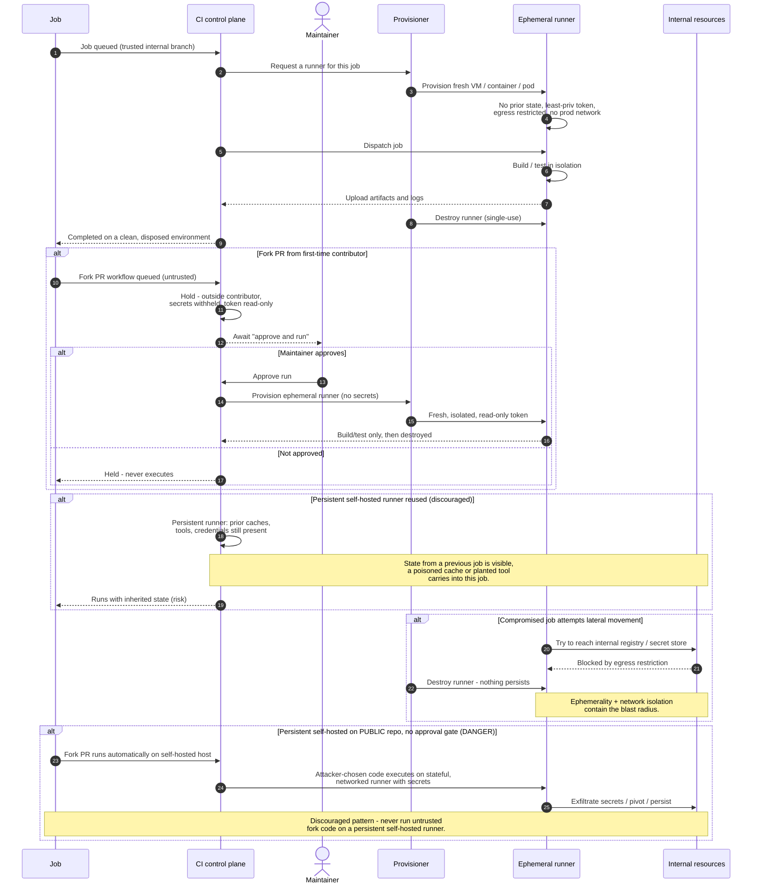

# Ephemeral Runner Isolation — Sequence Diagram

Happy path first (a trusted job runs on a fresh, isolated, single-use runner that is destroyed
after), then alternates: a first-time contributor's fork PR held for maintainer approval, a
persistent runner reused (state-leak risk), a compromised job's lateral-movement attempt
contained by isolation, and the discouraged public-repo self-hosted danger branch.

Notes

- The happy path's security is the last two steps: least-privilege token plus destroy-after,
  so nothing this job touched survives it.
- Fork PRs from outside contributors never auto-run and never receive secrets, a maintainer's
  "approve and run" is the gate, and even then the runner is ephemeral and secret-free.
- The persistent-runner alternate shows the state-leak mechanism: whatever a prior job left —
  cache, tool, credential, malware — is visible to the next job.
- The final `DANGER` branch is the explicitly discouraged pattern, the diagram depicts the
  exfiltration/pivot it enables so the risk is unmistakable.
