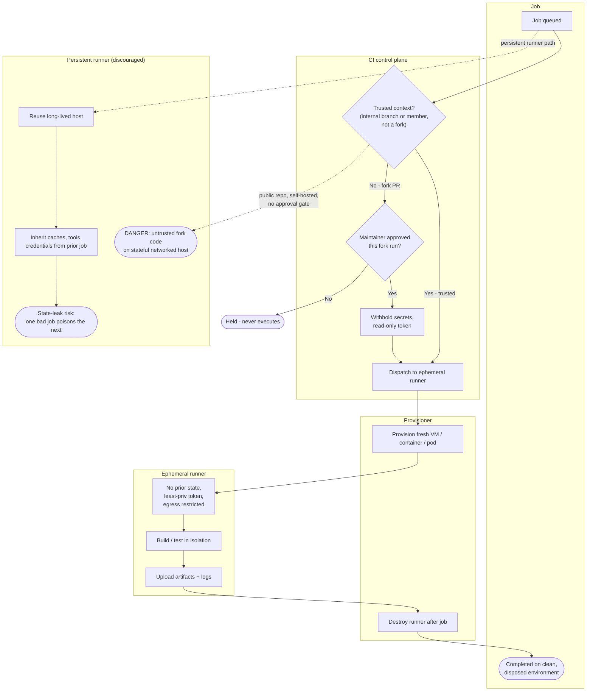

# Ephemeral Runner Isolation — Swimlane Diagram

One lane per component. Cross-lane arrows are the schedule, the provision, and the destroy.
The persistent-runner lane is the discouraged contrast, and the public-repo danger path is drawn
as a dashed branch to an explicit danger terminal.

Notes

- The `C1` trust gate splits internal (trusted) jobs, which flow straight to a fresh runner,
  from fork PRs, which must pass the `C2` maintainer-approval gate and run secret-free.
- The ephemeral lane's `P1 --> ... --> P2` cycle is the whole point: provision fresh, run
  isolated, destroy after — no state survives.
- The persistent lane is the discouraged contrast: `E2 --> E3` is the state-leak risk, and the
  dashed `C1 -.-> E4` path is the danger of running untrusted fork code on a stateful,
  networked, self-hosted host.
- See [flowchart.md](flowchart.md) for the full gate logic and the explicit danger terminal.
