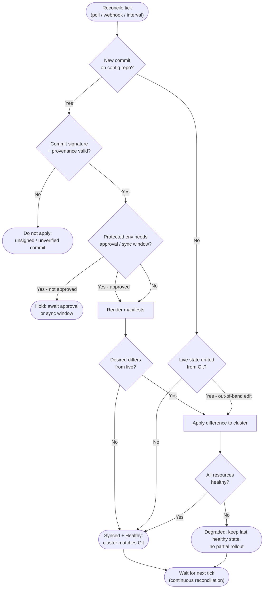

# GitOps Pull-Based Deploy — Decision Flowchart

The continuous reconciliation loop: detect the desired state in Git, verify it, diff against
live, apply, and check health. Drift correction, degraded, and rejection terminals are explicit.

Notes

- The loop runs continuously: even with no new commit, the `Drift` branch re-converges an
  out-of-band `kubectl` edit back to the Git-declared state (self-heal).
- A failed apply terminates at `Degraded` and preserves the last healthy state — there is never
  a half-applied rollout.
- Rollback is not a special path here: a `git revert` is simply a new commit that re-enters at `New`.
