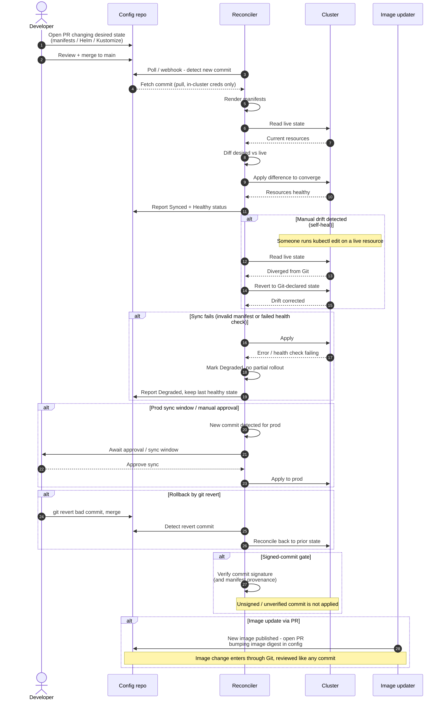

# GitOps Pull-Based Deploy — Sequence Diagram

Happy path first: a merge to the config repo is pulled by the in-cluster reconciler, diffed
against live state, and applied until the cluster converges. Then alternates: drift auto-heal,
a sync failure that degrades without partial rollout, a prod sync window / approval, rollback
by `git revert`, and a signed-commit gate.

Notes

- The reconciler always **pulls**: it fetches Git and reaches the cluster API from *inside*
  the cluster, so no external system holds cluster credentials.
- Reconciliation is continuous — drift is corrected on the next loop even with no new commit.
- A failed sync degrades to the last healthy state; there is no half-applied rollout.
- Rollback is a Git operation (`git revert`), because Git is the single source of truth.
