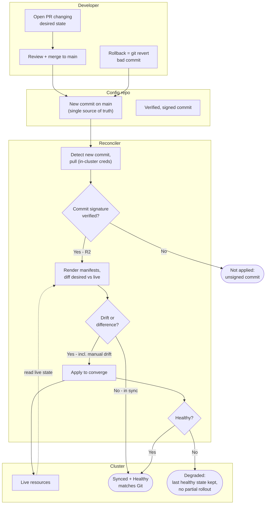

# GitOps Pull-Based Deploy — Swimlane Diagram

One lane per component. Note the arrow direction: the Reconciler lane reaches **out** to Git
and **into** the Cluster — nothing external reaches into the cluster, which is the whole point
of pull-based delivery.

Notes

- The `C4` gate fires on any divergence — a new commit *or* out-of-band `kubectl` drift — so
  self-heal and normal deploys share the same converge path.
- A failed apply lands in `K3` (Degraded), never a half-applied `K2`.
- Rollback (`D3`) is just another commit; it re-enters at `R1` and reconciles like any change.
- Every arrow into `Cluster` originates in the Reconciler lane — no external push.
