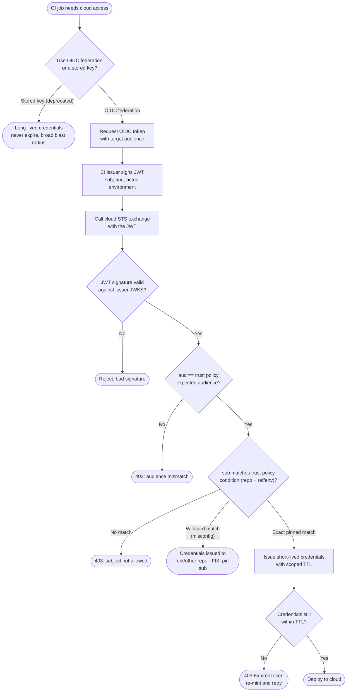

# OIDC to Cloud Federation — Decision Flowchart

Every gate the cloud STS applies before handing back credentials, plus the deprecated
stored-key branch. Deny paths terminate explicitly.

Notes

- The signature gate (`Q1`) comes first, but it is necessary, not sufficient — a validly
  signed token from an unexpected repo still must fail `Q2`/`Q3`.
- `Q3`'s wildcard branch is a misconfiguration, not a feature: pin `sub` to the exact
  `repo:org/repo:ref:...` or an `environment` claim so forks cannot assume the role.
- The expired-credential branch (`Q4`) re-mints a fresh token rather than caching a static
  secret — the whole point of the keyless model.
