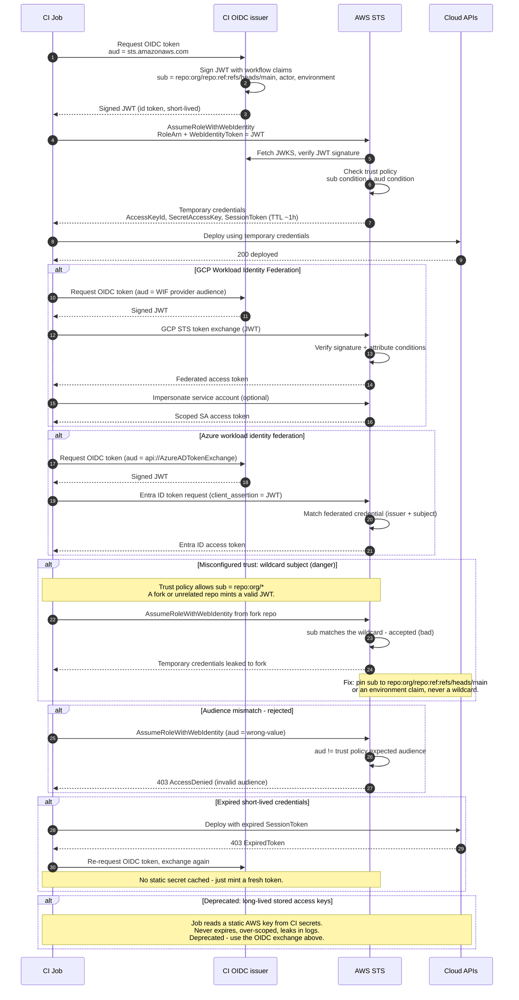

# OIDC to Cloud Federation — Sequence Diagram

Happy path first (GitHub Actions → AWS `AssumeRoleWithWebIdentity`), then the GCP and Azure
variants, and the rejection alternates: misconfigured wildcard subject, audience mismatch,
expired credentials, and the ⛔ deprecated stored-key branch.

Notes

- The JWT is minted per job and expires in minutes; the temporary cloud credentials it is
  exchanged for also carry a short TTL.
- STS validates the issuer signature via JWKS **and** the trust policy `sub`/`aud` conditions;
  both must pass.
- The wildcard-subject branch is the classic misconfiguration — a valid signature is not
  enough if any repo can produce a matching subject.
