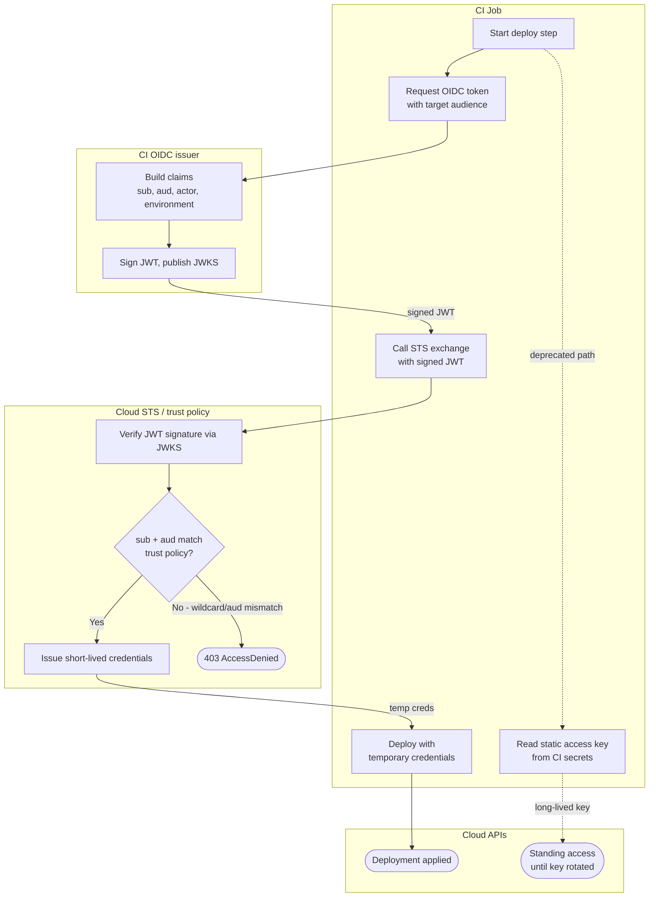

# OIDC to Cloud Federation — Swimlane Diagram

One lane per component. Cross-lane arrows are the token request, the exchange, and the deploy.
The deprecated stored-key path is drawn as a dashed dead-end branch.

Notes

- The `T2` gate is where claim-based trust is enforced; a passing signature at `T1` still
  fails here if the subject or audience does not match.
- The dashed `JX --> CX` branch is the ⛔ deprecated stored-key approach: no expiry, no
  claim scoping — kept here only to contrast with the federated path.
- See [flowchart.md](flowchart.md) for every validation gate and its deny terminal.
