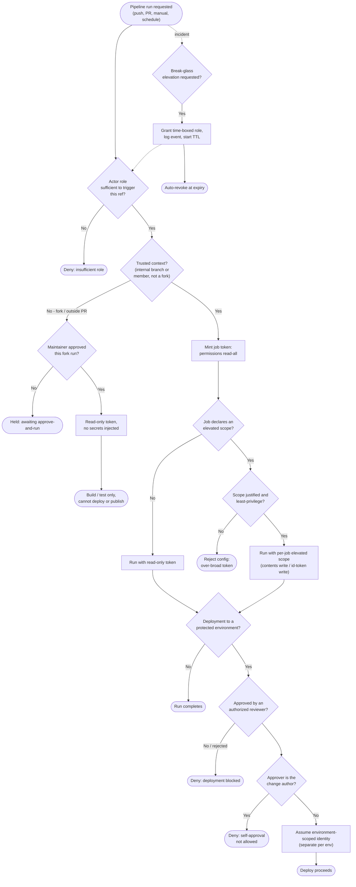

# Pipeline Access Control — Decision Flowchart

Every gate between "a run is requested" and "code executes with an identity": who may
trigger, whether the run is trusted, what token and secrets it receives, and the approval
gates for deployment. Deny paths terminate explicitly.

Notes

- The first gate is git-side role RBAC; the trust check then decides whether the run is a
  fork (untrusted) or internal (trusted) context.
- Least privilege is enforced twice: the base token is `read-all`, and any elevated scope
  must be justified per job (`ElevChk`) — an over-broad request is a config-review reject.
- The deployment gate adds a **human, non-self** approval before an environment-scoped
  identity is assumed, keeping prod credentials off ordinary runs.
- Break-glass is drawn as a dotted side path: it grants a time-boxed role that re-enters the
  normal role gate and auto-revokes at expiry, rather than a standing privilege.
