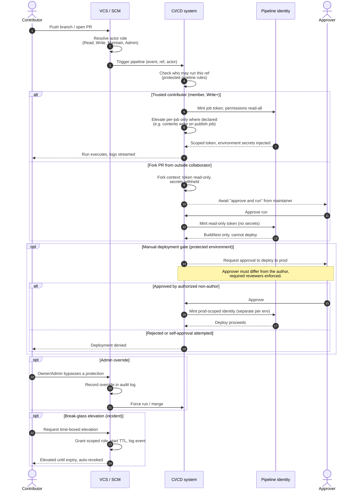

# Pipeline Access Control — Sequence Diagram

Happy path first (trusted contributor triggers a run with a least-privilege job token),
then alternates: fork PR from an outside collaborator (reduced token, no secrets),
a manual deployment approval gate, an admin override, and a break-glass elevation.

Notes

- The role resolution in step 2 is the git-side RBAC; the "who may run this ref" check in
  step 4 is the CI-side protected-pipeline rule. They are enforced separately.
- Least privilege is two moves: the job token starts at `read-all`, then individual jobs
  elevate only the scopes they need (`contents: write`, `packages: write`, `id-token: write`).
- Fork PRs never receive environment secrets or a write token without an explicit maintainer
  approval, which breaks the "malicious PR steals secrets" path.
- Break-glass and admin override both emit audit events; the elevation is time-boxed and
  auto-revoked rather than left standing.
