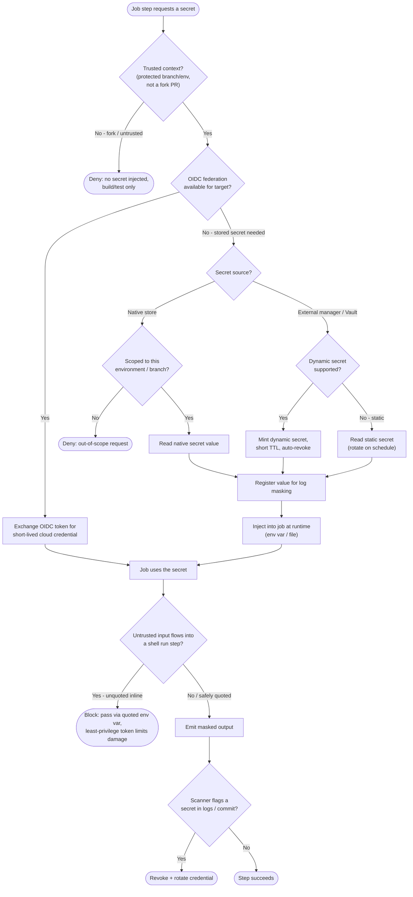

# Secrets Management in Pipelines — Decision Flowchart

The gates between "a job asks for a secret" and "the secret is safely used": is the context
trusted, which source serves it, is it masked and short-lived, and are exfiltration attempts
blocked. Deny/fail paths terminate explicitly.

Notes

- The first gate rejects untrusted/fork contexts outright — the single most important control
  against secret exfiltration from pull requests.
- OIDC is checked first on purpose: a short-lived federated credential leaves nothing at rest,
  so it is preferred over any stored secret (see [OIDC to cloud federation](../oidc-to-cloud-federation/README.md)).
- Native secrets must be **environment/branch scoped**; dynamic secrets add a short TTL and
  auto-revoke so a leak's blast radius is small.
- Masking and treating logs as public are complementary — the script-injection gate assumes an
  attacker can read output, so least privilege and quoted-env-var handling do the real work.
- Detection ends in revoke-and-rotate, not silent hope; pinning third-party actions to a SHA
  keeps a swapped dependency from reading the secret in the first place.
