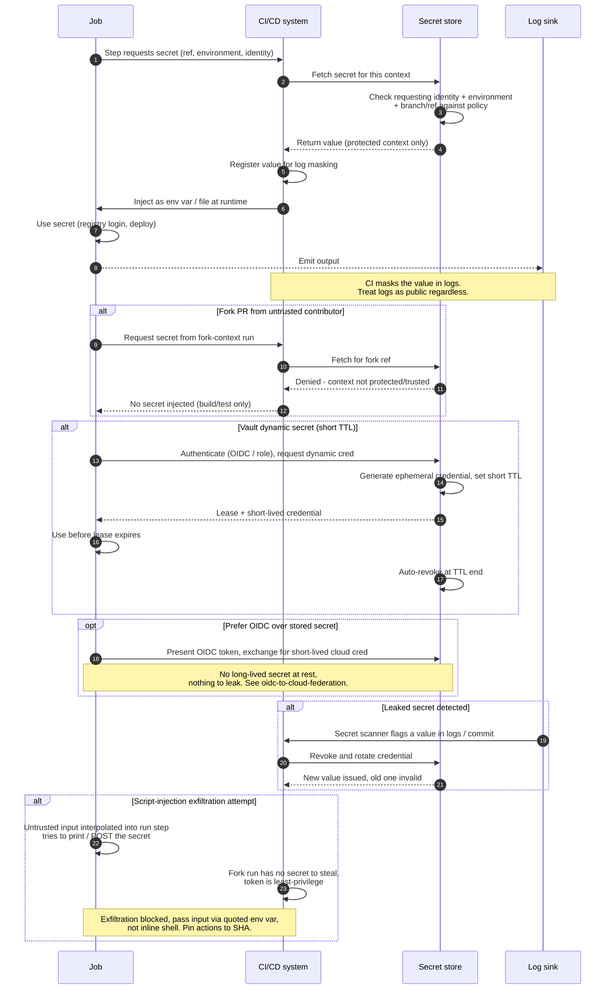

# Secrets Management in Pipelines — Sequence Diagram

Happy path first (trusted job requests a secret, store checks context, injects, masks),
then alternates: fork PR denied secrets, a Vault dynamic secret with a short TTL, a leaked
secret detected and revoked, and a script-injection exfiltration attempt that is blocked.

Notes

- The policy check in step 3 keys on **identity, environment, and branch/ref** — this is what
  keeps a feature branch or fork from reading production secrets.
- Masking (step 5) is best-effort; transformed forms of the value can still slip through, so
  logs are treated as public.
- The dynamic-secret and OIDC branches shrink the blast radius: short TTL means a leak expires
  quickly, and OIDC means there is no stored secret to leak at all.
- Revocation is the recovery path — detect, revoke, rotate — not "hope it wasn't seen".
