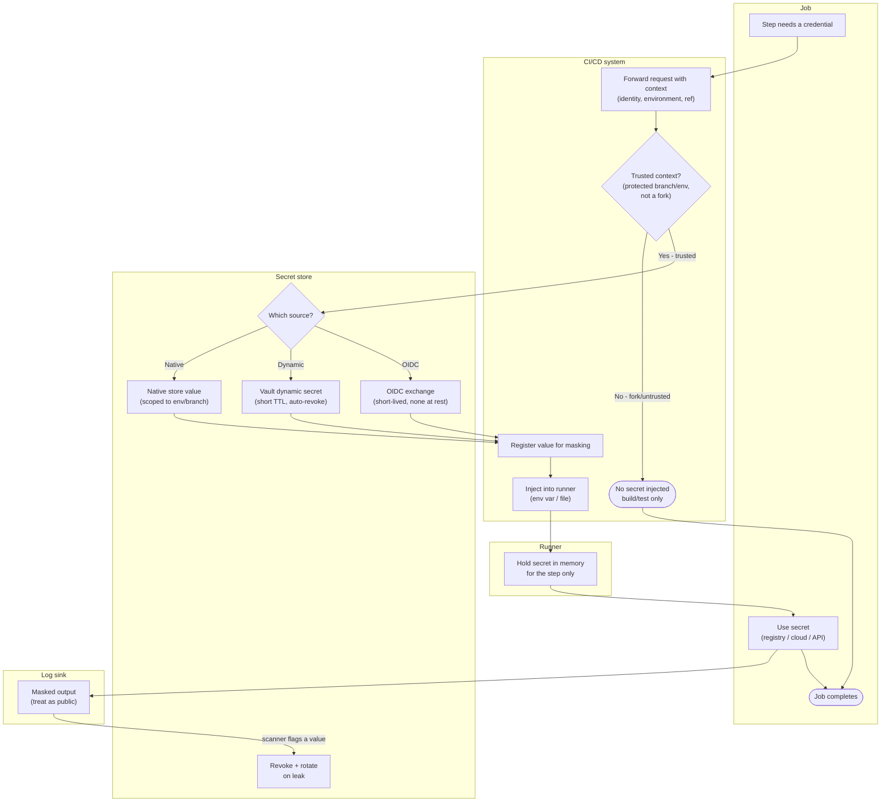

# Secrets Management in Pipelines — Swimlane Diagram

One lane per actor/component. Arrows crossing lanes show the secret's journey: request from
the job, policy check at the store, injection through the CI system onto the runner, and the
masked (but public-treated) log output.

Notes

- The trust gate (`C2`) is the exfiltration boundary: fork/untrusted runs never reach the
  store and get no secret (`C5`).
- The store lane shows the three sources ranked by safety — native stored value, dynamic
  short-TTL secret, and OIDC with nothing at rest (preferred).
- The runner holds the value in memory for the step only; ephemeral runners then discard it
  (see [Ephemeral runner isolation](../ephemeral-runner-isolation/README.md)).
- Masking happens before the log sink, but the log is still treated as public; a flagged value
  triggers revoke-and-rotate (`S5`).
