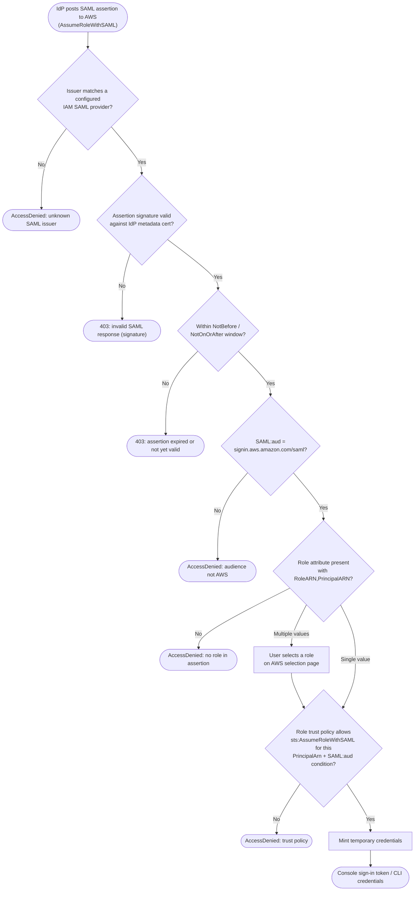

# AssumeRoleWithSAML — Decision Flowchart

Assertion validation and trust-policy gates STS applies, with explicit deny terminals.

Notes

- The `SAML:aud` gate is doubly important: STS checks it and the trust policy should also
  condition on it, so an assertion for another SP cannot be replayed against AWS.
- Signature validation uses the certificate published in the IdP metadata stored on the IAM
  SAML provider — never a certificate embedded only in the assertion.
- Multiple `Role` values branch to the role-selection page before the trust-policy gate.
